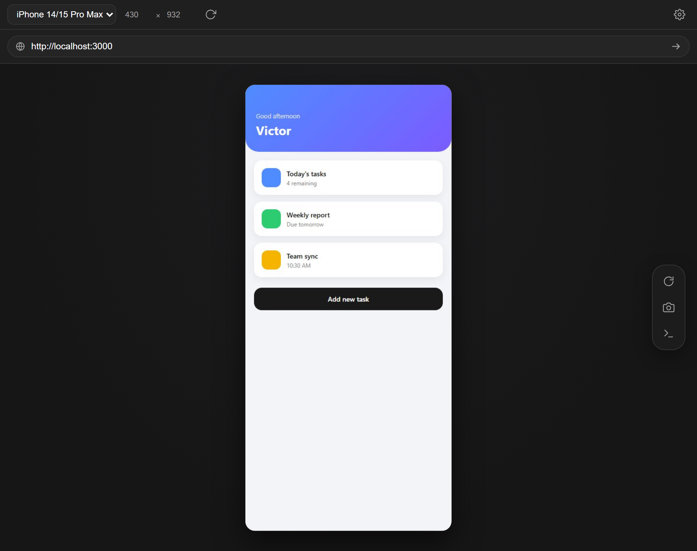
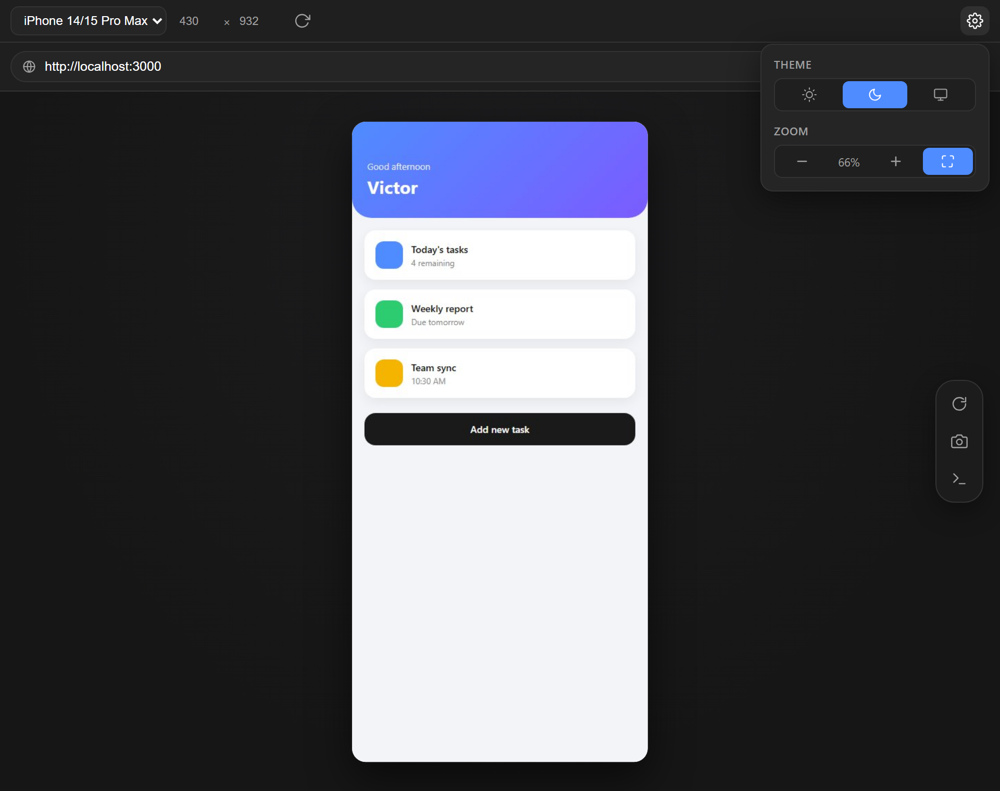
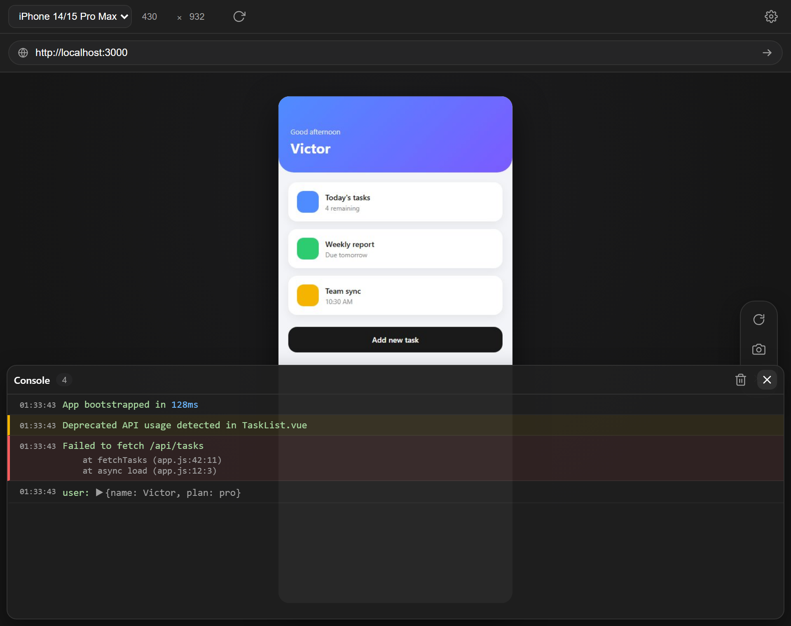

# Mobile Preview

Live mobile device preview for your local dev server, styled like Chrome DevTools' device toolbar — open it as an editor tab or dock it in either sidebar.

## Features

- **Real device emulation** — a headless Chromium instance (via Playwright) with the actual user-agent, touch support, color scheme, and pixel ratio of the selected device, so device-detection code (e.g. Ionic's `Platform.is('ios')`/`is('android')`) works correctly. Not a resized iframe.
- **Device presets**: iPhone SE/12/14/15/16 Pro Max, Pixel 7/9 Pro, Galaxy S8/S24, iPad Mini, or a custom width/height.
- **Rotate**, **zoom** (manual or auto-fit), and **light/dark/match VS Code theme** color-scheme emulation — tucked into a settings popover to keep the toolbar clean.
- **Real touch gestures** — mouse interaction on the preview is forwarded as actual touch events, the same way Chrome DevTools treats your mouse as a finger.
- **Screenshot** — pixel-accurate capture of exactly what's in the emulated viewport.
- **Console** — a real DevTools-style console (not simulated) with log levels, stack traces, and expandable objects/arrays, in a slide-up panel that takes no space when closed.
- Opens as an **editor tab** (beside your code) or as a **view in either sidebar** — all three can run independently at once, each with its own isolated browser session (separate `localStorage`/`sessionStorage`/cookies).
- Every setting (device, zoom, theme, URL) persists between sessions.

## Requirements

This extension uses [Playwright](https://playwright.dev/) to drive a real Chromium instance. The browser binary (~150–300MB) downloads automatically the first time it's needed — requires internet access and takes a minute or two. Subsequent launches are fast.

## Usage

1. Click the phone icon in the editor tab bar ("Open Mobile Preview"), or find "Mobile Preview" in the Activity Bar / Secondary Side Bar.
2. Type the URL of your local dev server in the address bar and press the arrow button.
3. Use the gear icon for device theme and zoom; the floating toolbar for reload, screenshot, and console.

## Known limitations

- Input is forwarded as touch events; single taps and drags work everywhere, but multi-finger gestures (pinch-zoom) aren't supported.
- The first load after opening VS Code launches a background Chromium process, which takes a few seconds ("Starting…").

## License

MIT — see the LICENSE file included with this extension.
